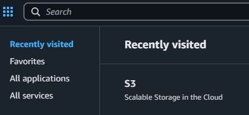
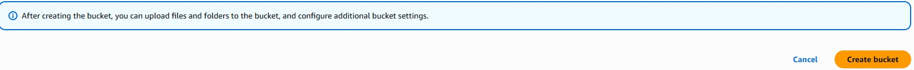
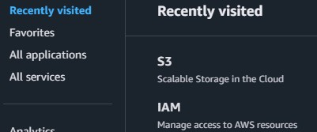
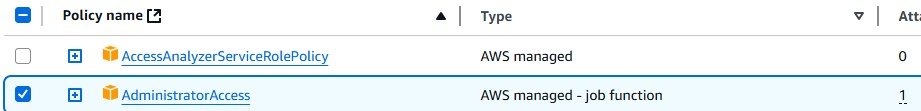
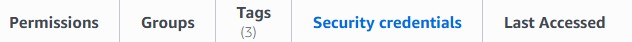

## Prerequisites

Before starting, ensure the following prerequisites are met:
1. AWS Account:
 - Access to an AWS account with IAM permissions to create resources.
 - (Optional if you want to use AWS CLI) AWS CLI installed and configured locally.

2. Terraform (1.13 or higher) installed on your local machine if you plan to deploy manually.

3. A GitHub repository to host GitHub actions and application files.

4. GitHub Actions enabled in your repository.

5. AWS S3 Bucket for terraform remote state file

6. Create access keys/IAM for Terraform

## Preparations

All steps can be performed in any order

### AWS S3 Bucket for Remote State

- Visit Management Console, then click on S3.



- Click on 'Create bucket'


- Give your bucket a name, enable versioning if you want, and click on 'Create bucket' below. Once it created, write down it's name in backend.tf file.



### Create access keys/IAM for Terraform

- Visit Management Console, then click on IAM.



- Click on 'Create user'

- At Step 1, specify user's name, click 'Next'

- At Step 2, click on 'Attach policies directly' and look for a policy 'AdministratorAccess'. Select it, then click 'Next'.



- On the final step, click Create user.

Once the user is created, go to it's settings and click on 'Security credentials'



Find 'Create access keys' button below and click on it.
- Specify 'Command Line Interface' as Use Case when presented, click on 'Confirmation' checkbox and click on 'Next'. Download the generated keys as a CSV file on the final screen.

## Deploy via GitHub Actions

...

## Deploy manually using Terraform locally
1. Create .aws/credentials file in your home directory (Linux/WSL) and copy the content of the CSV file you downloaded before. Your file should look like this:
```
[default]
aws_access_key_id=ASIA...
aws_secret_access_key=wJalrXUt...
```
2. Copy the created s3 bucket name to backend.tf file, after that run the command:
```
terraform init ---backend-config=backend.tf
```
- You shall get a message that the backend succesfully initialized and your bucket has a tfstate file now.

3. Check the content of [terraform.tfvars](terraform.tfvars) file to make sure it has values you need. 

Now you're ready to deploy and you can proceed with a `terraform plan` and `terraform apply` commands.

- Run `terraform plan` to see what will be created and if there any errors
- If the previous command didn't produce any errors, run `terraform apply` to deploy all components or use -target flag to specify modules/parts to deploy.

## Links

https://developer.hashicorp.com/terraform/language/backend/s3

https://developer.hashicorp.com/terraform/

https://developer.hashicorp.com/terraform/cli/commands/init

https://developer.hashicorp.com/terraform/cli/commands/plan

https://docs.aws.amazon.com/cli/v1/userguide/cli-configure-files.html
